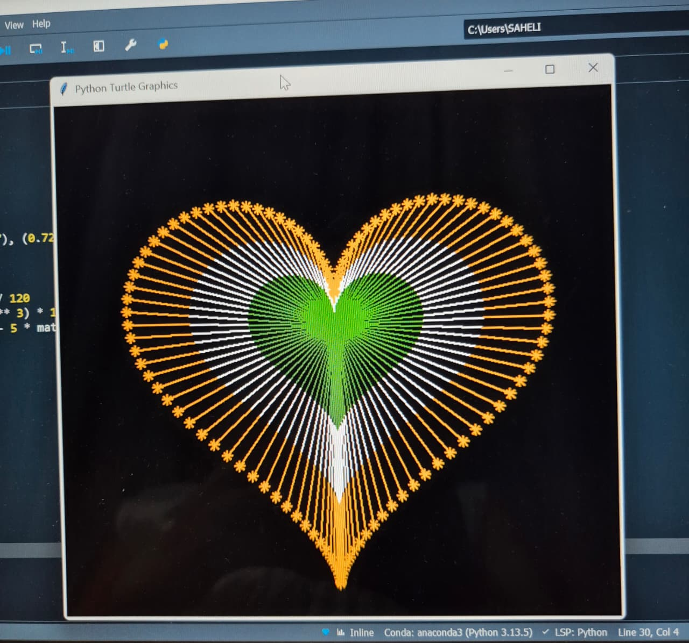

# 🇮🇳 Independence Day Tricolour Heart using Python Turtle

A creative Python Turtle Graphics project created to commemorate **India's Independence Day 2026**.

## 📌 About the Project

This project uses **Python Turtle Graphics** and mathematical equations to generate a heart-shaped design inspired by the colours of the Indian national flag — saffron, white, and green.

It demonstrates how programming and mathematics can be combined to create a visually engaging piece of creative coding.

## 🛠️ Technologies Used

* Python 3
* Turtle Graphics
* Math Module

## ⚙️ How It Works

The program uses mathematical equations to calculate points along a heart-shaped curve. Python Turtle then connects these points to generate the final design with different colours and patterns.

## ▶️ How to Run

1. Make sure Python 3 is installed.
2. Download or clone this repository.
3. Open the project folder.
4. Run the Python file:

```bash
python "tricolor heart.py"
```

A Turtle Graphics window will open and generate the design.

## 🖼️ Output



## 🇮🇳 Independence Day 2026

This project was created as a small creative coding initiative to celebrate the spirit of **Independence Day** and explore the creative possibilities of Python programming.

**Happy Independence Day! 🇮🇳**

## 👩‍💻 Author:

**Saheli Nath**
